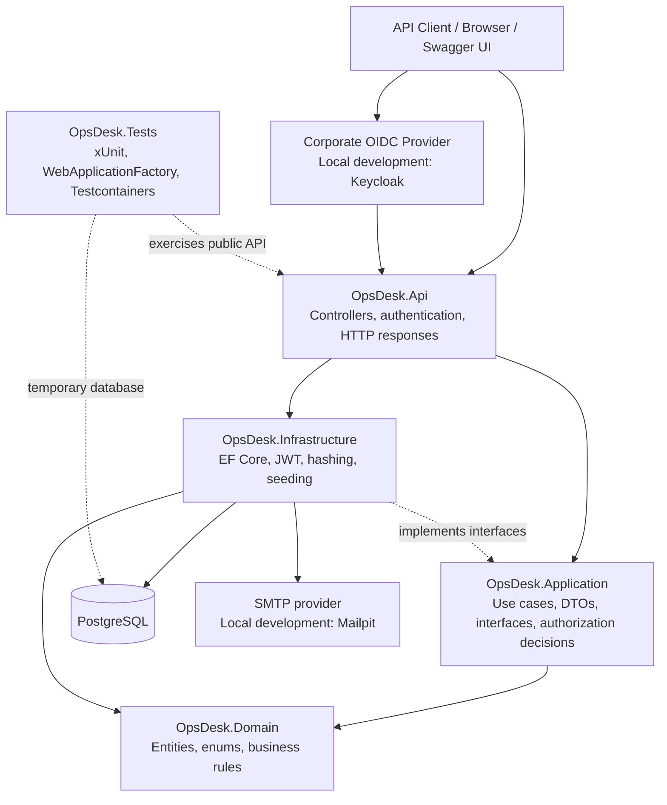

# OpsDesk API

[](https://github.com/hmzckd/opsdesk-api/actions/workflows/ci.yml)

OpsDesk API is a production-style .NET 10 backend for an internal support and operations desk. Users can authenticate, create support Tickets, and retrieve Ticket details according to role-based visibility rules.

See [CHANGELOG.md](CHANGELOG.md) for release notes.

## Capabilities

- Environment-controlled Customer registration and password login
- Email verification, administrator invitations, and password recovery
- Optional corporate OpenID Connect sign-in with invitation-owned OpsDesk roles
- Password hashing with ASP.NET Core Identity
- JWT access-token generation and validation
- `Admin`, `Agent`, and `Customer` roles
- Admin-only Agent account provisioning with server-owned roles
- Policy-based authorization and Ticket visibility
- Ticket creation with server-owned status, requester, and timestamps
- Priority-based resolution SLA deadlines and current breach state
- Ticket detail access for the requester, eligible Agents, and Admins
- Agent self-assignment and Admin assignment management
- Assignment activity with optimistic concurrency protection
- Role-aware Ticket lifecycle transitions with persisted status history
- Public Ticket comments with role-aware visibility
- Combined Ticket activity timeline with safe actor summaries
- Requester-confirmed closure after support resolution
- Requester-only reopen flow with a required public reason
- Email, password, and Ticket input validation
- Idempotent admin-user seeding from local secrets
- Standardized Problem Details error responses
- PostgreSQL persistence with EF Core migrations
- Swagger UI with Bearer-token support
- Health-check endpoint
- Unit, API, and PostgreSQL Testcontainers tests
- Cobertura coverage reports in GitHub Actions
- Docker Compose development environment
- Mailpit email capture and an opt-in Keycloak development profile
- GitHub Actions build and test workflow

## Tech Stack

- .NET 10 and ASP.NET Core Web API
- Entity Framework Core 10
- PostgreSQL 16 and Npgsql
- JWT Bearer authentication
- OpenID Connect authorization-code flow with PKCE and local Keycloak
- xUnit and `WebApplicationFactory`
- Testcontainers for disposable PostgreSQL integration tests
- Swashbuckle / Swagger UI
- Docker Compose

## Architecture



The projects are sibling directories under `src`; the arrows represent code and runtime relationships, not folder nesting. `OpsDesk.Domain` is the independent core. `OpsDesk.Application` coordinates business use cases. `OpsDesk.Infrastructure` supplies technical implementations, and `OpsDesk.Api` exposes them through HTTP.

```text
src/OpsDesk.Api             HTTP endpoints, middleware, Swagger
src/OpsDesk.Application     Auth and Ticket workflows, DTOs, interfaces, policies
src/OpsDesk.Domain          User and Ticket entities, roles, status, priority
src/OpsDesk.Infrastructure  EF Core, PostgreSQL, JWT, hashing, seeding
tests/OpsDesk.Tests         Unit and API integration tests
```

## API Endpoints

| Method | Endpoint | Access | Description |
|---|---|---|---|
| `POST` | `/auth/register` | Anonymous, when enabled | Register a Customer; returns 403 when public registration is disabled |
| `POST` | `/auth/login` | Anonymous | Log in and receive a JWT |
| `POST` | `/auth/email-verification/confirm` | Anonymous | Verify ownership with a one-time email token |
| `POST` | `/auth/email-verification/resend` | Anonymous | Queue another verification email without disclosing account existence |
| `POST` | `/auth/forgot-password` | Anonymous | Queue a password-recovery email without disclosing account existence |
| `POST` | `/auth/reset-password` | Anonymous | Replace a local password with a valid one-time reset token |
| `POST` | `/auth/invitations/accept` | Anonymous | Create a verified account from a valid one-time invitation |
| `GET` | `/auth/sso/login` | Browser, when enabled | Display the invitation bootstrap form and begin corporate OIDC sign-in |
| `POST` | `/auth/sso/logout` | Authenticated | Revoke every local JWT and return the separate provider logout URL |
| `GET` | `/me` | Authenticated | Read the current token identity |
| `POST` | `/admin/invitations` | Admin | Invite a Customer or Agent without exposing the raw token in the API response |
| `POST` | `/admin/agents` | Admin | Provision an Agent account with validated credentials |
| `POST` | `/tickets` | Authenticated | Create a Ticket for the current user |
| `GET` | `/tickets` | Authenticated | List visible Tickets with optional paging, filtering, and sorting |
| `GET` | `/tickets/{id}` | Authenticated and visible | Read one Ticket without leaking protected Tickets |
| `PUT` | `/tickets/{id}/assignee` | Agent or Admin | Assign a Ticket to an Agent; Agents can only select themselves |
| `DELETE` | `/tickets/{id}/assignee` | Agent or Admin | Remove the current assignee within the caller's ownership scope |
| `PATCH` | `/tickets/{id}/status` | Authenticated and authorized | Change status and record the transition |
| `POST` | `/tickets/{id}/reopen` | Ticket requester | Reopen a resolved Ticket and store the required public reason atomically |
| `GET` | `/tickets/{id}/status-history` | Authenticated and visible | Read chronological status history with actor IDs |
| `POST` | `/tickets/{id}/comments` | Authenticated and visible | Add a public comment with server-owned author and time |
| `GET` | `/tickets/{id}/comments` | Authenticated and visible | Read public comments from oldest to newest |
| `GET` | `/tickets/{id}/activity` | Authenticated and visible | Read the role-appropriate comment, status, assignment, and system-generated `sla_breached` timeline; system events have `actor: null` |
| `GET` | `/admin/access` | Admin | Verify the `AdminOnly` policy |
| `GET` | `/health` | Anonymous | Check API process health |
| `GET` | `/swagger` | Anonymous | Open interactive API documentation |

## Ticket Collection Query

Every query parameter is optional. Omitted values use page `1`, page size `20`, and newest-created-first sorting.

| Parameter | Accepted values |
|---|---|
| `page` | Integer starting at `1` |
| `pageSize` | Integer from `1` to `100` |
| `status` | `open`, `in_progress`, `waiting_customer`, `resolved`, `closed` |
| `priority` | `low`, `medium`, `high`, `urgent` |
| `requesterId` | User GUID |
| `assigneeId` | Agent GUID |
| `unassigned` | `true` to return only unassigned Tickets; `false` applies no filter |
| `sortBy` | `createdAtUtc`, `updatedAtUtc`, `priority` |
| `sortDirection` | `asc`, `desc` |

```http
GET /tickets?page=1&pageSize=20
GET /tickets?status=open&priority=high
GET /tickets?unassigned=true&sortBy=priority&sortDirection=desc
```

The response contains compact Ticket items plus `page`, `pageSize`, `totalCount`, `totalPages`, `hasPreviousPage`, and `hasNextPage` metadata.

## Email Input Contract

- Email addresses accept at most 320 characters. Surrounding whitespace is trimmed during normalization, while whitespace inside the address is rejected.
- The domain must contain at least two non-empty labels, such as `company.com`.
- `admin@opsdesk.local` remains valid for the development admin seed.
- This validation checks syntax only; it does not query DNS, inspect MX records, or prove mailbox ownership.

## Public Registration

`Registration:PublicRegistrationEnabled` defaults to `false`. The committed `appsettings.Development.json` explicitly sets it to `true` for local development. Demo or other non-production environments must opt in; Production cannot enable it.

| Environment and configuration | Behavior |
| --- | --- |
| Setting absent | Public registration disabled |
| Development/demo with `true` | Existing registration and email verification flow |
| Any environment with `false` | Valid `POST /auth/register` requests return 403 without account creation or verification email |
| Production with `true` | Startup fails with a configuration error, before database preparation |

For deployment, use the environment variable `Registration__PublicRegistrationEnabled=false` and set the actual host environment to `Production`. Treat ASP.NET Core environment selection as deployment configuration; a server incorrectly labeled Development is not detected as Production automatically. Restart the application after changing this setting. Invalid boolean values fail startup; malformed HTTP bodies can still receive model-validation 400 responses.

The Application service enforces the restriction, not just the Controller or Swagger. Existing login, email confirmation, password recovery, admin invitations/acceptance, and admin Agent provisioning remain available. This switch does not remove existing users, revoke JWTs, disable password login, or configure SSO. The endpoint remains documented in Swagger.

To disable public registration in your local development environment, run from the repository root and restart the API:

```powershell
dotnet user-secrets set Registration:PublicRegistrationEnabled false --project src/OpsDesk.Api
```

To remove that local override and use the committed Development setting again:

```powershell
dotnet user-secrets remove Registration:PublicRegistrationEnabled --project src/OpsDesk.Api
```

See [AUTH-004 implementation notes](docs/agents/auth-004-registration-policy.md) for method explanations and test evidence. No database migration is required for this feature.

## Corporate SSO

SSO is disabled by default. OpsDesk uses standard OpenID Connect authorization code plus PKCE, while its existing JWT remains the credential used for API calls. On first SSO sign-in, the provider-verified email must match an active OpsDesk administrator invitation. The invitation supplies the local `Customer` or `Agent` role; provider role claims are deliberately ignored. Returning users are identified by the stable provider `issuer + subject` pair, not by email.

Complete the base [Run Locally](#run-locally) database and JWT setup first. Then prepare local-only Keycloak secrets and matching .NET User Secrets from the repository root:

```powershell
powershell -NoProfile -ExecutionPolicy Bypass -File scripts/setup-local-sso.ps1
```

Start the supporting services. The `sso` profile opts into Keycloak; it is not started by the default Compose command:

```powershell
docker compose -f docker-compose.yml -f docker-compose.sso.yml --profile sso up -d postgres mailpit keycloak
```

Run the API on its configured HTTP profile:

```powershell
dotnet run --project src/OpsDesk.Api --launch-profile http
```

Local browser flow:

1. As the development Admin, create an invitation for `sso.agent@example.com` through `POST /admin/invitations`.
2. Open Mailpit at `http://localhost:8025` and copy the invitation code from that email.
3. Open `http://localhost:5044/auth/sso/login`, enter the invitation code, and continue to Keycloak.
4. Sign in as `sso.agent@example.com`. Its generated local-development password is stored under `KEYCLOAK_DEMO_USER_PASSWORD` in the ignored `.env` file.
5. The callback returns the normal OpsDesk `AuthResponse`; use its `accessToken` as the Swagger Bearer token.

`POST /auth/sso/logout` immediately increments the account's server-side session version, so previously issued OpsDesk JWTs stop working. Its `providerLogoutUrl` is a separate browser step that ends the Keycloak/corporate-provider session. Local logout still succeeds if the provider logout endpoint is temporarily unavailable.

Keycloak `start-dev` is only a local test provider. A production deployment must use HTTPS, an exact public origin and redirect URI, an exact corporate email-domain allowlist, and a secret manager for `Sso__ClientSecret`. Configure `Sso__Enabled=true`, `Sso__Authority`, `Sso__ClientId`, `Sso__ClientSecret`, `Sso__PublicOrigin`, and `Sso__AllowedEmailDomains__0`. Never commit provider secrets or reuse the generated local values. See [AUTH-005 browser-flow notes](docs/agents/auth-005-sso-browser-flow.md) for the protocol and method explanations.

## Ticket Input Contract

- `title` is required and accepts at most 200 characters.
- `description` is required and accepts at most 5,000 characters.
- `priority` is optional and defaults to `medium`.
- Priority values are `low`, `medium`, `high`, and `urgent`.
- Resolution SLA durations are 7 days for `low`, 4 days for `medium`, 2 days for `high`, and 24 hours for `urgent`.
- Ticket creation, detail, and collection responses expose `slaDeadlineUtc` and the calculated `isSlaBreached` state; clients cannot provide either value.
- Comment content is required and accepts at most 4,000 characters.
- Reopen reason is required and uses the same 4,000-character limit as a public comment.
- OpenAPI publishes required fields, string limits, and enum values for API clients and frontend controls.

## Run Locally

Requirements: .NET 10 SDK, Docker Desktop, and Git.

Create the local environment file. The committed example contains development-only values; deployed environments must provide their own secrets:

```powershell
Copy-Item .env.example .env
```

Start PostgreSQL:

```powershell
docker compose up -d postgres
```

Restore packages:

```powershell
dotnet restore OpsDesk.sln --configfile NuGet.Config
```

Store the local PostgreSQL connection string outside source control:

```powershell
dotnet user-secrets set ConnectionStrings:DefaultConnection "Host=localhost;Port=5432;Database=opsdesk;Username=opsdesk;Password=opsdesk" --project src/OpsDesk.Api
```

Set a development JWT signing key:

```powershell
dotnet user-secrets set Jwt:SecretKey OpsDeskDevelopmentSecretKey!2026-ChangeMe --project src/OpsDesk.Api
```

Development startup applies pending migrations automatically. You can still apply them explicitly without starting the API:

```powershell
dotnet ef database update --project src/OpsDesk.Infrastructure --startup-project src/OpsDesk.Api
```

Run the API:

```powershell
dotnet run --project src/OpsDesk.Api
```

Open `http://localhost:5044/swagger` or use the URL printed by `dotnet run`.

To run both PostgreSQL and the API through Docker Compose:

```powershell
docker compose up --build
```

Then open `http://localhost:8080/swagger`.

## Development Admin Seed

Admin seed values are read from .NET User Secrets and are not committed to Git. The seeder checks the normalized email before insertion, so restarting the API does not create duplicate admins.

```powershell
dotnet user-secrets set AdminSeed:Enabled true --project src/OpsDesk.Api
```

```powershell
dotnet user-secrets set AdminSeed:FirstName System --project src/OpsDesk.Api
```

```powershell
dotnet user-secrets set AdminSeed:LastName Administrator --project src/OpsDesk.Api
```

```powershell
dotnet user-secrets set AdminSeed:Email admin@opsdesk.local --project src/OpsDesk.Api
```

```powershell
dotnet user-secrets set AdminSeed:Password Admin123! --project src/OpsDesk.Api
```

These values are for local development only. Use a proper secret manager in deployed environments.

## Tests

Docker Desktop must be running because the integration-test fixture starts a temporary PostgreSQL 16 container. The container is shared by the integration-test collection and removed automatically after the test run.

```powershell
dotnet test OpsDesk.sln
```

To generate a local Cobertura coverage report:

```powershell
dotnet test OpsDesk.sln --collect:"XPlat Code Coverage" --results-directory TestResults
```

The test suite covers authentication, validation, authorization, Ticket behavior, EF Core migrations, PostgreSQL constraints, and HTTP contracts. `WebApplicationFactory` starts the real ASP.NET Core application while Testcontainers supplies a temporary PostgreSQL instance. GitHub Actions uploads `coverage.cobertura.xml` as the `coverage-report` artifact.

## Design Decisions

- Domain and Application projects do not depend on EF Core or HTTP concerns.
- Passwords are hashed and never stored or returned as plain text.
- JWT secrets and admin seed credentials remain outside source control.
- Provider client secrets remain outside source control; SSO stays disabled until a complete validated configuration is supplied.
- OIDC state, nonce, correlation cookies, anti-forgery validation, and PKCE protect the browser handoff.
- Raw invitation codes never enter the provider redirect URL; only a hash is stored in protected OIDC state.
- Provider identity proves who signed in, while the OpsDesk invitation remains the authority for the local role.
- Local JWT revocation and provider browser logout are intentionally separate operations.
- Registration always creates a `Customer`; elevated roles cannot be self-selected.
- Admin Agent provisioning always creates an `Agent`; request payloads cannot select or override the role.
- Admin seeding creates missing data but never silently promotes an existing user.
- Named authorization policies keep role rules centralized and reusable.
- Ticket visibility is decided in the Application layer and enforced by read-only database queries.
- Customers and Agents receive `404 Not Found` for Tickets outside their visibility scope, preventing resource discovery.
- Agents can read unassigned or self-assigned Tickets, but can mutate only self-assigned Tickets; Admins can access every Ticket.
- Agents can claim only unassigned Tickets or repeat their own assignment; they cannot take a Ticket assigned to another Agent.
- Assignment endpoints are idempotent: repeating the same assignment or unassignment does not create activity or alter timestamps.
- Ticket concurrency tokens prevent simultaneous claims from overwriting each other; one request wins and the loser receives `409 Conflict`.
- Every real assignment change stores the actor, previous assignee, new assignee, and server-owned UTC time.
- Ticket status and its history record are saved atomically in one database transaction.
- Agents and Admins resolve Tickets; only the requester confirms final closure.
- Only the requester can reopen a resolved Ticket, through the dedicated endpoint with a public reason.
- Reopen updates the Ticket, public reason Comment, and status-history record in one database transaction.
- Comment author identity and creation time come from the authenticated server request, not client input.
- Comment reads use creation time and Comment ID for deterministic chronological ordering.
- The activity endpoint combines existing records instead of duplicating them in a separate activity table.
- Customers see public comments and status changes; assignment history remains internal to Agents and Admins.
- Activity items include safe actor summaries and use time, type, then ID for deterministic ordering.
- A Ticket snapshots its active priority policy and UTC resolution deadline when created; later policy changes and reopen operations do not recalculate that deadline.
- Current SLA breach state is derived from the stored deadline and resolution or observation time instead of persisting a time-sensitive boolean.
- A configurable background worker atomically stores at most one durable SLA breach event per Ticket; the event appears in authorized activity timelines with no User actor.
- Global exception handling maps expected failures to consistent API responses.

## Roadmap

- `V2.0`: Ticket creation, visibility, lifecycle, and status history
- `V2.1`: Ticket comments, assignment, and activity timeline
- `V2.2`: Ticket filtering, sorting, and pagination
- `V3`: SLA policies and deadlines, followed by audit logs, approvals, and background jobs
- `V4`: Human-approved .NET AI triage and summarization
- `V5`: Optional Python worker for embeddings, similarity search, and reranking

AI-assisted triage will suggest summaries, priorities, similar tickets, and routing targets. It will not change ticket state without human approval.
