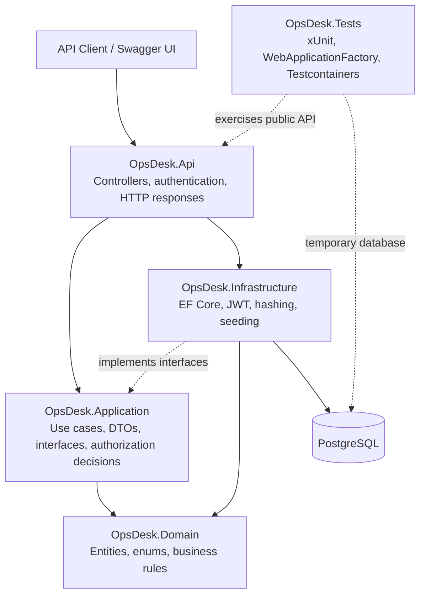

# OpsDesk API

[](https://github.com/hmzckd/opsdesk-api/actions/workflows/ci.yml)

OpsDesk API is a production-style .NET 10 backend for an internal support and operations desk. Users can authenticate, create support Tickets, and retrieve Ticket details according to role-based visibility rules.

See [CHANGELOG.md](CHANGELOG.md) for release notes.

## Capabilities

- Customer registration and login
- Password hashing with ASP.NET Core Identity
- JWT access-token generation and validation
- `Admin`, `Agent`, and `Customer` roles
- Policy-based authorization and Ticket visibility
- Ticket creation with server-owned status, requester, and timestamps
- Ticket detail access for the requester, eligible Agents, and Admins
- Agent self-assignment and Admin assignment management
- Assignment activity with optimistic concurrency protection
- Role-aware Ticket lifecycle transitions with persisted status history
- Public Ticket comments with role-aware visibility
- Combined Ticket activity timeline with safe actor summaries
- Requester-confirmed closure after support resolution
- Requester-only reopen flow with a required public reason
- Email, password, and Ticket input validation
- Idempotent admin-user seeding from local secrets
- Standardized Problem Details error responses
- PostgreSQL persistence with EF Core migrations
- Swagger UI with Bearer-token support
- Health-check endpoint
- Unit, API, and PostgreSQL Testcontainers tests
- Cobertura coverage reports in GitHub Actions
- Docker Compose development environment
- GitHub Actions build and test workflow

## Tech Stack

- .NET 10 and ASP.NET Core Web API
- Entity Framework Core 10
- PostgreSQL 16 and Npgsql
- JWT Bearer authentication
- xUnit and `WebApplicationFactory`
- Testcontainers for disposable PostgreSQL integration tests
- Swashbuckle / Swagger UI
- Docker Compose

## Architecture



The projects are sibling directories under `src`; the arrows represent code and runtime relationships, not folder nesting. `OpsDesk.Domain` is the independent core. `OpsDesk.Application` coordinates business use cases. `OpsDesk.Infrastructure` supplies technical implementations, and `OpsDesk.Api` exposes them through HTTP.

```text
src/OpsDesk.Api             HTTP endpoints, middleware, Swagger
src/OpsDesk.Application     Auth and Ticket workflows, DTOs, interfaces, policies
src/OpsDesk.Domain          User and Ticket entities, roles, status, priority
src/OpsDesk.Infrastructure  EF Core, PostgreSQL, JWT, hashing, seeding
tests/OpsDesk.Tests         Unit and API integration tests
```

## API Endpoints

| Method | Endpoint | Access | Description |
|---|---|---|---|
| `POST` | `/auth/register` | Anonymous | Register a customer |
| `POST` | `/auth/login` | Anonymous | Log in and receive a JWT |
| `GET` | `/me` | Authenticated | Read the current token identity |
| `POST` | `/tickets` | Authenticated | Create a Ticket for the current user |
| `GET` | `/tickets/{id}` | Authenticated and visible | Read one Ticket without leaking protected Tickets |
| `PUT` | `/tickets/{id}/assignee` | Agent or Admin | Assign a Ticket to an Agent; Agents can only select themselves |
| `DELETE` | `/tickets/{id}/assignee` | Agent or Admin | Remove the current assignee within the caller's ownership scope |
| `PATCH` | `/tickets/{id}/status` | Authenticated and authorized | Change status and record the transition |
| `POST` | `/tickets/{id}/reopen` | Ticket requester | Reopen a resolved Ticket and store the required public reason atomically |
| `GET` | `/tickets/{id}/status-history` | Authenticated and visible | Read chronological status history with actor IDs |
| `POST` | `/tickets/{id}/comments` | Authenticated and visible | Add a public comment with server-owned author and time |
| `GET` | `/tickets/{id}/comments` | Authenticated and visible | Read public comments from oldest to newest |
| `GET` | `/tickets/{id}/activity` | Authenticated and visible | Read the role-appropriate combined comment, status, and assignment timeline |
| `GET` | `/admin/access` | Admin | Verify the `AdminOnly` policy |
| `GET` | `/health` | Anonymous | Check API process health |
| `GET` | `/swagger` | Anonymous | Open interactive API documentation |

## Ticket Input Contract

- `title` is required and accepts at most 200 characters.
- `description` is required and accepts at most 5,000 characters.
- `priority` is optional and defaults to `medium`.
- Priority values are `low`, `medium`, `high`, and `urgent`.
- Comment content is required and accepts at most 4,000 characters.
- Reopen reason is required and uses the same 4,000-character limit as a public comment.
- OpenAPI publishes required fields, string limits, and enum values for API clients and frontend controls.

## Run Locally

Requirements: .NET 10 SDK, Docker Desktop, and Git.

Create the local environment file. The committed example contains development-only values; deployed environments must provide their own secrets:

```powershell
Copy-Item .env.example .env
```

Start PostgreSQL:

```powershell
docker compose up -d postgres
```

Restore packages:

```powershell
dotnet restore OpsDesk.sln --configfile NuGet.Config
```

Store the local PostgreSQL connection string outside source control:

```powershell
dotnet user-secrets set ConnectionStrings:DefaultConnection "Host=localhost;Port=5432;Database=opsdesk;Username=opsdesk;Password=opsdesk" --project src/OpsDesk.Api
```

Set a development JWT signing key:

```powershell
dotnet user-secrets set Jwt:SecretKey OpsDeskDevelopmentSecretKey!2026-ChangeMe --project src/OpsDesk.Api
```

Development startup applies pending migrations automatically. You can still apply them explicitly without starting the API:

```powershell
dotnet ef database update --project src/OpsDesk.Infrastructure --startup-project src/OpsDesk.Api
```

Run the API:

```powershell
dotnet run --project src/OpsDesk.Api
```

Open `http://localhost:5044/swagger` or use the URL printed by `dotnet run`.

To run both PostgreSQL and the API through Docker Compose:

```powershell
docker compose up --build
```

Then open `http://localhost:8080/swagger`.

## Development Admin Seed

Admin seed values are read from .NET User Secrets and are not committed to Git. The seeder checks the normalized email before insertion, so restarting the API does not create duplicate admins.

```powershell
dotnet user-secrets set AdminSeed:Enabled true --project src/OpsDesk.Api
```

```powershell
dotnet user-secrets set AdminSeed:FirstName System --project src/OpsDesk.Api
```

```powershell
dotnet user-secrets set AdminSeed:LastName Administrator --project src/OpsDesk.Api
```

```powershell
dotnet user-secrets set AdminSeed:Email admin@opsdesk.local --project src/OpsDesk.Api
```

```powershell
dotnet user-secrets set AdminSeed:Password Admin123! --project src/OpsDesk.Api
```

These values are for local development only. Use a proper secret manager in deployed environments.

## Tests

Docker Desktop must be running because the integration-test fixture starts a temporary PostgreSQL 16 container. The container is shared by the integration-test collection and removed automatically after the test run.

```powershell
dotnet test OpsDesk.sln
```

To generate a local Cobertura coverage report:

```powershell
dotnet test OpsDesk.sln --collect:"XPlat Code Coverage" --results-directory TestResults
```

The test suite covers authentication, validation, authorization, Ticket behavior, EF Core migrations, PostgreSQL constraints, and HTTP contracts. `WebApplicationFactory` starts the real ASP.NET Core application while Testcontainers supplies a temporary PostgreSQL instance. GitHub Actions uploads `coverage.cobertura.xml` as the `coverage-report` artifact.

## Design Decisions

- Domain and Application projects do not depend on EF Core or HTTP concerns.
- Passwords are hashed and never stored or returned as plain text.
- JWT secrets and admin seed credentials remain outside source control.
- Registration always creates a `Customer`; elevated roles cannot be self-selected.
- Admin seeding creates missing data but never silently promotes an existing user.
- Named authorization policies keep role rules centralized and reusable.
- Ticket visibility is decided in the Application layer and enforced by read-only database queries.
- Customers and Agents receive `404 Not Found` for Tickets outside their visibility scope, preventing resource discovery.
- Agents can read unassigned or self-assigned Tickets, but can mutate only self-assigned Tickets; Admins can access every Ticket.
- Agents can claim only unassigned Tickets or repeat their own assignment; they cannot take a Ticket assigned to another Agent.
- Assignment endpoints are idempotent: repeating the same assignment or unassignment does not create activity or alter timestamps.
- Ticket concurrency tokens prevent simultaneous claims from overwriting each other; one request wins and the loser receives `409 Conflict`.
- Every real assignment change stores the actor, previous assignee, new assignee, and server-owned UTC time.
- Ticket status and its history record are saved atomically in one database transaction.
- Agents and Admins resolve Tickets; only the requester confirms final closure.
- Only the requester can reopen a resolved Ticket, through the dedicated endpoint with a public reason.
- Reopen updates the Ticket, public reason Comment, and status-history record in one database transaction.
- Comment author identity and creation time come from the authenticated server request, not client input.
- Comment reads use creation time and Comment ID for deterministic chronological ordering.
- The activity endpoint combines existing records instead of duplicating them in a separate activity table.
- Customers see public comments and status changes; assignment history remains internal to Agents and Admins.
- Activity items include safe actor summaries and use time, type, then ID for deterministic ordering.
- Global exception handling maps expected failures to consistent API responses.

## Roadmap

- `V2.0`: Ticket creation, visibility, lifecycle, and status history
- `V2.1`: Ticket comments, assignment, and activity timeline
- `V2.2`: Ticket filtering, sorting, and pagination
- `V3`: SLA policies, audit logs, approvals, and background jobs
- `V4`: Human-approved .NET AI triage and summarization
- `V5`: Optional Python worker for embeddings, similarity search, and reranking

AI-assisted triage will suggest summaries, priorities, similar tickets, and routing targets. It will not change ticket state without human approval.
