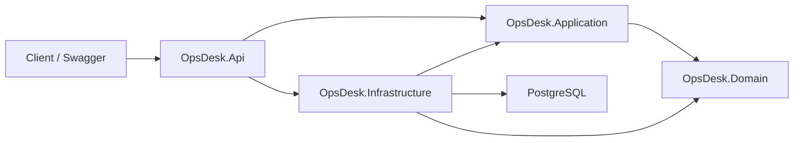

# OpsDesk API

[](https://github.com/hmzckd/opsdesk-api/actions/workflows/ci.yml)

OpsDesk API is a production-style .NET 10 backend for an internal support and operations desk. The current V1 release provides secure user authentication, role-based authorization, PostgreSQL persistence, API documentation, admin seeding, and automated tests.

## V1 Features

- Customer registration and login
- Password hashing with ASP.NET Core Identity
- JWT access-token generation and validation
- `Admin`, `Agent`, and `Customer` roles
- Policy-based authorization for admin and support operations
- Email and password validation
- Idempotent admin-user seeding from local secrets
- Standardized error responses with appropriate HTTP status codes
- PostgreSQL persistence with EF Core migrations
- Swagger UI with Bearer-token support
- Health-check endpoint
- Unit and API integration tests
- Docker Compose development environment
- GitHub Actions build and test workflow

## Tech Stack

- .NET 10 and ASP.NET Core Web API
- Entity Framework Core 10
- PostgreSQL 16 and Npgsql
- JWT Bearer authentication
- xUnit and `WebApplicationFactory`
- EF Core InMemory provider for isolated API tests
- Swashbuckle / Swagger UI
- Docker Compose

## Architecture



The projects are sibling directories under `src`; the arrows represent project/code dependencies, not folder nesting. `OpsDesk.Domain` is the independent core, `OpsDesk.Application` uses domain types, and `OpsDesk.Infrastructure` implements application interfaces with technical services such as EF Core, PostgreSQL, JWT generation, and password hashing.

```text
src/OpsDesk.Api             HTTP endpoints, middleware, Swagger
src/OpsDesk.Application     Auth workflows, DTOs, interfaces, policies
src/OpsDesk.Domain          User entity and roles
src/OpsDesk.Infrastructure  EF Core, PostgreSQL, JWT, hashing, seeding
tests/OpsDesk.Tests         Unit and API integration tests
```

## API Endpoints

| Method | Endpoint | Access | Description |
|---|---|---|---|
| `POST` | `/auth/register` | Anonymous | Register a customer |
| `POST` | `/auth/login` | Anonymous | Log in and receive a JWT |
| `GET` | `/me` | Authenticated | Read the current token identity |
| `GET` | `/admin/access` | Admin | Verify the `AdminOnly` policy |
| `GET` | `/health` | Anonymous | Check API process health |
| `GET` | `/swagger` | Anonymous | Open interactive API documentation |

## Run Locally

Requirements: .NET 10 SDK, Docker Desktop, and Git.

Start PostgreSQL:

```powershell
docker compose up -d postgres
```

Restore packages:

```powershell
dotnet restore OpsDesk.sln --configfile NuGet.Config
```

Set a development JWT signing key:

```powershell
dotnet user-secrets set Jwt:SecretKey OpsDeskDevelopmentSecretKey!2026-ChangeMe --project src/OpsDesk.Api
```

Apply the database migration:

```powershell
dotnet ef database update --project src/OpsDesk.Infrastructure --startup-project src/OpsDesk.Api
```

Run the API:

```powershell
dotnet run --project src/OpsDesk.Api
```

Open `http://localhost:5044/swagger` or use the URL printed by `dotnet run`.

## Development Admin Seed

Admin seed values are read from .NET User Secrets and are not committed to Git. The seeder checks the normalized email before insertion, so restarting the API does not create duplicate admins.

```powershell
dotnet user-secrets set AdminSeed:Enabled true --project src/OpsDesk.Api
```

```powershell
dotnet user-secrets set AdminSeed:FirstName System --project src/OpsDesk.Api
```

```powershell
dotnet user-secrets set AdminSeed:LastName Administrator --project src/OpsDesk.Api
```

```powershell
dotnet user-secrets set AdminSeed:Email admin@opsdesk.local --project src/OpsDesk.Api
```

```powershell
dotnet user-secrets set AdminSeed:Password Admin123! --project src/OpsDesk.Api
```

These values are for local development only. Use a proper secret manager in deployed environments.

## Example Authentication Flow

Register:

```http
POST /auth/register
Content-Type: application/json

{
  "firstName": "Hamza",
  "lastName": "Test",
  "email": "hamza@example.com",
  "password": "ValidPass!"
}
```

A successful register or login response includes the user identity, role, access token, and token expiration time. Add the token through Swagger's **Authorize** dialog or send it as `Authorization: Bearer <token>`.

## Authorization

- `AdminOnly` requires the JWT role claim to be `Admin`.
- `AgentOrAdmin` accepts either `Agent` or `Admin` and is ready for V2 support workflows.
- Missing authentication returns `401 Unauthorized`.
- Authenticated users without the required role receive `403 Forbidden`.

## Tests

```powershell
dotnet test OpsDesk.sln
```

V1 contains 18 tests covering validators, registration, login, duplicate email handling, JWT-protected identity, admin seeding, and role-based access. API integration tests start the real ASP.NET Core application in memory through `WebApplicationFactory`, replace PostgreSQL with a disposable InMemory database, and send HTTP requests through a test client.

The current InMemory tests validate application behavior but do not reproduce every PostgreSQL-specific behavior. A future testing milestone will add **Testcontainers for PostgreSQL** so migrations, constraints, and repository behavior can be verified against a real disposable database container.

## Design Decisions

- Domain and Application projects do not depend on EF Core or HTTP concerns.
- Passwords are hashed and never stored or returned as plain text.
- JWT secrets and admin seed credentials remain outside source control.
- Registration always creates a `Customer`; elevated roles cannot be self-selected.
- Admin seeding creates missing data but never silently promotes an existing user.
- Named authorization policies keep role rules centralized and reusable.
- Global exception handling maps expected failures to consistent API responses.

## Roadmap

- `V1.1`: PostgreSQL Testcontainers integration tests and test coverage reporting
- `V2`: Ticket lifecycle, comments, assignment, filtering, and pagination
- `V3`: SLA policies, audit logs, approvals, and background jobs
- `V4`: Human-approved .NET AI triage and summarization
- `V5`: Optional Python worker for embeddings, similarity search, and reranking

AI-assisted triage will suggest summaries, priorities, similar tickets, and routing targets. It will not change ticket state without human approval.
